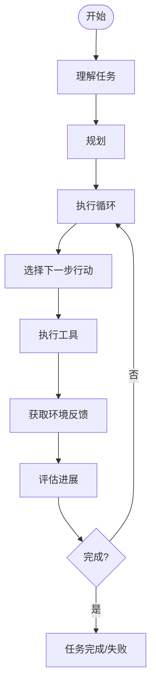

2026/01/03: 李博杰的 Agent 课，当 Agent 科普入门，也试一下 Ob 记笔记

---

## CH1: Start

大概思路就是传统 RL -> LLM RL，以及 LLM RL 的一些学习机制和 Agent 组合架构。

### 传统 RL

**传统 RL 基础要素**： Action, policy, reward, value function, model，这个model是环境model，比如说是环境是不是有限的，可评估的，比如 value iteration 中环境的每个 state 相关的reward和转移的reward或者 action 概率这些。根据这个又分成了 model-free 和 model-based 模型。

**MDP**： 重要的马尔科夫假设，只跟上一个状态和动作有关。

**Q-learning**： 这里边又是传统 RL 的内容，Bellman fn， TD learning 这些。MDP 效率低泛化差，也没法用先验知识。


### LLM + RL

**LLM+RL**： 创新 
1. `<think></think>` 这种纳入 action space ，能用先验知识，或者 zero/one-shot。
2. action 多样性提高，有了 tool 之后提升很多

**LLM+RL 的 on/off policy**：这也对应着 agent 三种学习机制
1. ICL on policy 
2. post-training off policy离线数据集 RL 
3. RAG, KB, Tool-generation 两种都有

**传统和 LLM RL 区别**: 一个是符号映射体系，一个基于语义理解。重要是 LLM RL 能利用先验知识以及 ICL 泛化能力。从成本来看前者比后者成本低很多，但是我们还要注意的是交互的成本，比如说你调用工具/获取环境信息的成本和进行试错的成本等。所以综合来看其实LLM RL 的性价比不错。


### Agent 设计模式

其实就是设计经验总结，主要就两种： workflow 和 autonomous，前者就是认为设计好的流程，只不过流程中间是 agent 去执行；后者就是流程是不固定的，更符合现实情况。当然这也是根据成本来，有些更适合workflow 固定的情况，成本会低一点。

**Workflow 的一些设计模式**: 
1. Prompt chaining: 就是线性流程，模块之间用门控检查效果，子任务需要划分清晰
2. Routing: 把多个线性前边加一个 router，比如说客户服务系统：退款请求，技术自持；或者是模型路由，某些问题用小模型回答节约成本
3. Parallelization: 主要有 sectioning，多个视角解决一个问题，最后 voting 解决问题
4. Orchestrator-Workers: 这回不是人 sectioning 了，是LLM去划分问题了，最后 LLM 再综合一下问题。
5. Evaluator-optimizer: 考一个 evaluator 评估是不是达到要求，比如说翻译的任务，多次审查翻译质量。

**Autonomous Agent**：开放式问题比如说 SWE-Agent 这种，但是你要注意成本和边界控制、停止条件等问题，可能需要添加人机交互的部分。


**Agent 单个/多个的权衡**: templates 模板管理 prompt。可以通过判断 *逻辑是否过于复杂*
和 *工具是不是过载* 判断是不是用多个 agent，但是最好还是先保证一个 agent 的能力最大化。有两种 multi-agent模式：
1. Manager Pattern: 就是把专业 agent 当作是 tool 来调用。有一个 manager 管理，这样和用户交互的就只是这个 manager了，一个模型。
2. Decentralized Pattern:  就是没有管理者，是一个 agent 网络在处理问题。


**安全问题**: 数据隐私或者品牌偏好这种问题会出现，可以通过规则+LLM审查过滤掉。有这么几个防护措施：query与主题的相关性、prompt安全性、PII过滤、语言情感审核、工具保护措施、规则防护、输出验证 ....

**核心原则**: 简单性，透明性，接口设置。透明性就是可理解性，比如说 agent 规划的 todolist， 执行日志，用户需要看到这些。接口设置就是工具文档和测试。


### Others
1. . 有监督-无监督-RL 三个训练体系，无监督强调环境结构，RL 强调完成目标；
2. Agent 的边界时 Agent 有绝对控制权的界限，不是知识的界限
3. on/off policy 就是看行为 policy 和 目标 policy 是不是一个，如果是一个那就是 on，否则就是 off。DPO 就是典型 off。off 的好处是可以从任何数据学习（也就是在学这个数据的分布？），也可以多个policy一起学，坏处就是 shift 高方差。
4. 上下文包括什么： sys prompt + conversation history + tool history + agent reasoning history + 用户记忆 + 外部知识


## CH2: Context

----------draft---------
表现不好全是上下文的错，文档不清晰，知识分散、隐性（经验），有的公司也不分享，或者私聊

ReAct 模式，主要是分解成 reason-action 循环，每个循环中：reason-action-observe

通过 chat template 管理上下文结构 `tokenizer_config.json` 中的 chat_template Jinja2 模板

Qwen3-0.6B 里边的逻辑是：保留最后一个真实用户消息之后的所有思考内容，一定程度解决上下文膨胀。
```jinja


  
  
    
    
  

```

思维链：
```jinja

    

    
      
    
      
        
        
      
    

    
      
        {{- '<|im_start|>' + message.role
            + '\n<think>\n' + reasoning_content.strip('\n') + '\n</think>\n\n'
            + content.lstrip('\n') }}
      
        {{- '<|im_start|>' + message.role + '\n' + content }}
      
    
      {{- '<|im_start|>' + message.role + '\n' + content }}
    
```


另外这样的情况下，如果你将tool当作user消息传递了，那一个是可能格式错误，另一个是按照上边的机制会清理之前的 reasoning过程。当然这是在 history 中的组织形式，真正要给 LLM 的文本的那里你可以包装成user 消息或者进行其他设计，好处：不用额外定义 tool 开始结尾标记，支持连续多个tool调用：

```jinja

    
      {{- '<|im_start|>user' }}
    

    {{- '\n<tool_response>\n' }}
    {{- content }}
    {{- '\n</tool_response>' }}

    
      {{- '<|im_end|>\n' }}
    
  
```

对应就是
```text
<|im_start|>user
<tool_response>
...工具输出...
</tool_response>
<tool_response>
...工具输出...
</tool_response>
<|im_end|>
```


上下文末尾添加 assistant，然后禁不禁用 thinking功能
```jinja

  {{- '<|im_start|>assistant\n' }}
  
    {{- '<think>\n\n</think>\n\n' }}
  
```

流式响应: 流式状态机解析器切换模式(thinking)，工具调用时候当 `<tool_call>` 出现就开始解析模式进行解析，然后 UI 那边就显示出来了，agent在干什么一清二楚。

然后怎么又切换到 attention去了：
- Attention sink: 第一个 token的注意力权重很高，有时候 >70%，它的解释是存放不需要分配其他具体token的权重
- think内的呈现互相互相关注，思考如何工具调用，参数定义啥的
- think 之后的内容互相关注，输出回答

所以大海捞针的关注前边的和末尾的，可以用 attention sink 和上边这个沿着推理往回看的现象来解释。

ICL 竟然还有理论解释，可以理解成对模型内部参数的隐式、低秩更新。[Learning without training: The implicit dynamics of in-context learning](https://arxiv.org/abs/2507.16003)


KV cache 上下文设计：某些模式会破坏 KV Cache有效性，影响 agent
带来影响：1. 成本上升，从头计算 attn 2. 首token生成时间(TTFT)增加了
典型错误：
1. 动态系统提示词，在sys promtp中加入现在的时间之类
2. 工具定义的动态排序
3. 动态用户配置：剩余 API调用次数或者账户余额每次都更新一下，如果嵌入到上下文（sys promtp这种不变的上下文）当中会破坏缓存，可以通过状态管理机制处理，而不是作为 history
4. 滑动窗口对话历史：忘记调用历史，上下文一致性
5. 文本格式化：把结构化的 role-content 改成了纯文本那种，这样就是 1. 某些 KVCACHE依靠这种结构化进行cache 2. 破坏模型在训练阶段使用的结构


应该怎么搞？
1. 上下文稳定性：sys prompt，工具定义，基础配置等等不变，追加设计
2. 保持模型训练的格式
3. 管理对话历史要完整保留，不要选择性删除


转向 prompt eng:

tips:
1. 语气风格：规定几行回答，要求不解释等等
2. XML+ markdown 的结构化：比如说 `<working_directory>C:/xxx/xxxx</working_directory>`
3. 表述清晰、有逻辑，有步骤
4. 大写字母引导注意
5. 工具描述的质量
	1. 明确使用边界：能干什么，不能干什么
	2. 具体的使用指导，不是抽象功能
	3. 性能+成本提示
	4. 工具协作关系
	5. 副作用和限制透明化，overwrite existing file ..... truncated reading ...
	6. 默认行为的明确说明，比如说default value
	7. 输出格式精确描述
6. 业务规则细化程度：产品相关，提示词设计由产品经理完成，需要对关键业务逻辑、关键计算流程等由具体细致的说明


“System Hint”：动态嵌入的结构化元信息->什么鬼，哦好像就是一个阶段性的小总结，总结的内容是前文的一些meta信息。比如说打电话打了几次这个场景，上下文里边存储的其实是打电话的内容而非次数，Agent那这时候就蒙b了，不知道几次了，我们可以总结一下。**强制性的注意力引导 <system_hint></system_hint>**

> 那也就是手动构造阶段性的 attn sink

这种信息分为几种：
- 任务规划：todolist
- side-channel information: 事件发生的环境信息，事件包括用户输入和工具调用结果。信息是比如说用户输入时间(`[2026-01-07 10:00:00] model response ....`)、地理位置、距离上次回复距离多久等等
- 环境的当前状态：
	- 动态环境信息：system time, operation env, 当前工作目录之类的
	- 异常操作提醒：比如说某个工具已经被调用N次了
	- 隐式状态到显式状态的转换：agent trajectory 是怎么演变的，可以显式的写出来

> 只能放到末尾，因为 KV Cache的关系

几个例子：
- time stamp: `[time] ...`
- 工具计数器： 全局维护一个字典之类的
- todolist: 在实现中，系统提供了两个专门的工具:`rewrite todo1ist`用于创建和重写待办事项，`update todostatus`用于更新任务状态。每个TODO项包含唯一标识符、内容描述、状态(`pending、in progress、completed、 cancelled`)以及时间戳。TODO列表的运作机制体现了深思熟虑的设计。当Agent接收到包含3个或更多独立步骤的复杂任务时，系统提示词中的规则会引导它立即创建TODO列表。这个列表不是静态的装饰，而是动态的工作记忆。Agent在执行过程中会不断更新任务状态:开始某项任务时标记为in progress，完成后标记为completed，遇到障碍时可能标记为cancelled并添加新的替代任务。
- 详细错误信息
	- 错误描述
	- 参数信息
	- 调用栈
	- 修复建议
- 系统状态感知：时间、工作目录、操作系统类型、Shell环境、Python版本....

**设计哲学：透明vs.控制的平衡 -> meta信息**


现在转向 ICL 上下文学习：

ICL 接近 RAG， 是利用 高维 embedding的soft retrieval.由此产生问题：上下文本身没规律可言，不会形成抽象的模型 -> 长上下文也会导致检索精度的下降。这也是个特点，从好的方面说，如果能忘掉那些不重要的信息，那确实能专注于提炼规律

> 因此，构建高效的Agent系统不能仅仅依赖模型的上下文学习能力。我们需要:第一，通过系统提示技术将关键信息显式化，强制模型关注;第二，通过上下文压缩策略主动提炼知识，而非期待模型自动归纳;第三，通过用户记忆系统将知识持久化，而非每次都从原始对话重新学习。这些技术的共同点是:它们都是显式的、工程化的知识管理方法，而非依赖模型的隐式能力。

动态提示词和 Agent Skills

Skills 主要是解决跨领域任务上的一些问题，主要就是动态 prompt给 agent 不同领域的知识

Skills: 包含专业领域知道的提示词集合，采用渐进式披露，主要通过 `SKILL.md` 这个文档来交互。（感觉上就是一个完备的仓库，里边有各种工具之类的）
- 结构：
	- layer1: meta 数据层：`SKILL.md`, `yaml` 结构，agent 启动的时候加载的是这些元数据
	- layer2: 需要某个 SKILL 时主动读取完整的 SKILL.md 文件
	- layer3: SKILL.md 也能引用其他文档作为细则
	- layer3: SKILL 也可以捆绑可执行的代码工具和模板文件
 - SKILLS 变成一个可以更换的模块，比较容易社区共同开发之类的
 - Agent 自己去找这个知识文档，然后根据这个文档得到一些技能和工具


> [Claude Skills](https://platform.claude.com/docs/en/agents-and-tools/agent-skills/overview)


最后就是用户记忆系统

记忆层次结构：
- trajectory：事件序列
- use long-term memory：跨对话、跨实例持久化存储，与用户绑定
- business state: 开发者定义的高层状态抽象，用于表示任务的逻辑截断，比如说需要澄清、处理请求中、等待付款之类的


记忆划分：
- 感觉记忆
- 短期记忆
- 长期记忆
	- 情景记忆
	- 语义记忆
	- 程序记忆


记忆的表示与存储：主要就是向量嵌入，存储这些 embedding 就是用向量数据库
- Mem0
- HNSW 算法
- LSH 算法


LOCOMO 基准测试，评估记忆系统。在这里怎么评价： 1. 基础回忆: fact 2. 多会话检索：多时间检索，分辨有效关联信息 3. 主动服务：发现在记忆中的联系并给出解决方案

渐进式记忆模式存储： 

- Simple Notes
	- 原子化事实陈述，丢失联系
- Enhanced Notes
	- 记忆保存为完整的上下文段落，适合细微处理
	- 代价时存储空间需求比较大，嵌入表示的维度固定，相似度计算就不准确，检索性能下降
- JSON Cards
	- 组织成 json 的形式，分类比较好；
	- 但是实际上现实世界很难去进行分类；分类体系也很难去说。
- Advanced JSON Cards
	- 在上边的基础上添加了故事背景、身份标识，关系，时间戳之类的，添加一些定语而已；
	- 但是就是成本高了点：生成成本需要推理；随时间变化的维护成本；...
- 知识图谱
	- entity-relation-entity
	- 还是本体论的局限性，三元组表达不出来真实的关系性

> 就是全面性和简单性的一种权衡


一些框架与机制：
- 又提到 Mem0 框架了，这是什么玩应：[mem0](https://mem0.ai/), [Mem0: Building Production-Ready AI Agents with Scalable Long-Term Memory](https://arxiv.org/abs/2504.19413)
- Memobase 框架：多类型记忆的协同管理，这又是什么：[Memobase](https://docs.memobase.io/introduction)
	- 事件序列 -> 情感，时间，任务标识
	- 语义记忆：知识图谱
	- 程序记忆：重复出现的问题解决模式
	- 记忆压缩与整理：重要性评分筛选->聚类筛选（相似记忆分组）->抽象和泛化（找规律）->冲突监测和解决（版本控制+筛选对比）


一些隐私保护问题：
- 上下文敏感信息分级：公开信息，内部信息，机密信息
	- 内部信息保留关键特征，比如电话前几位
	- 机密信息直接占位符替换，LLM只能看到占位符，最后再注入
- 日志脱敏（这个之前没想到）
	- 本地检测：基于 LLM /基于正则表达式
	- 不能让敏感信息出现在不必要看到他的组件或者人员视野中


----------draft---------


## CH3：Knowledge Base

介绍 RAG
- Dense Embedding：ANN 索引算法
	- ANNOY 算法：树结构的向量检索方法，数据就是二叉树，通过在子空间内进行递归迭代划分，直到每个空间剩下 K 个节点
	- HNSW 算法：用构建好的图的节点来找连接最近的 N 个顶点。
- Sparse  Embedding: 
	- TF-IDF:一个词在文档中越重要，则在该文档中出现的频率越高，在整个文档集合中出现的频率越低。这两个概率相乘得到给每个词的权重；没考虑到文档长度，词频率增长是线性的而重要性可能不是线性的
	- BM25：加入 `k1`，控制词频的饱和度，`b` 控制文档长度的归一化程度
- Hybrid Search：三个截断
	- 并行检索：dense, sparse 分别召回一些候选
	- merge：结果合并，进行精细筛选，RRF 合并
	- Neural Reranking：用更大的模型进行排序

多模态信息提取
- 原生多模态处理：统一的语义空间
	- 这样能理解图片内容，内容与词汇的关系，与语义的关系之类的
	- 分析图标，理解文档布局nb
- 转化为文本
	- OCR，音频转录，就把非文本转化为纯文本，再把文本给 LLM
	- 纯文本主导文档nb
- 多模态分析作为工具
	- 刚开始用纯文本，但是也有工具能对图片进行分析
	- 低成本处理初步查询，需要时用高成本深度分析

之前 RAG  的局限性：chunks 没有关联性，也就是扁平化

结构化索引： 存知识之前要投入更多计算资源，产生一个易于查询的知识结构
- RAPTOR：递归的知识树，长文档切成小文本，作为叶子节点，然后聚类将叶子节点分组，然后为每个分组生成高层次摘要作为父节点，最后形成知识树
- GraphRAG:建模成实体和关系的知识图谱，再提取关系，然后通过一些图上的算法，Community Detection 算法找到语义相似集群，再生成集群摘要

Agentic RAG : 
- 检索就是可调用的工具，可以调用外部知识库获取数据，这种就 cover 了 回忆、简单多对话检索等
	- 但是检索的内容本身可能会有矛盾，那最终判断的时候就会出问题，不知道哪个是对的。也就是检索的 chunking 都是独立的，没有什么关联
- Contextual Retrieval
	- 给 chucking 摘要，然后和原始的 chunking拼接到一起进行索引
	- 代价就是构建时间和成本比较高，也是属于一种前期投资了
- Advanced JSON Cards + contextual retrieval
	- 可以理解成，从 Ad JSON Cards 的记忆出发，Agent 在执行的时候遇到需要上下文搜索的情景时再进行contextual retrieval 上下文检索，形成了一种“考虑全面，主动服务” 的感觉

以上是结构化的知识处理，实际上还有案例学习这种隐性的知识，这种就需要新的 RAG，就是两个步骤：知识提取与结构化 -> 因子分析与重要性建模。因子分析的时候可以用一些离散型的建模，比如说 one-hot，主要是清晰归因到某个因子上。

Agent 应该有从经验中学习的能力，主要有以下范式：
- 后训练
	- 内化规则，缩短 CoT，降低响应延迟
	- RL 数据合成和 reward 机制很重要
- 上下文学习
	- [Deeper Insights Without Updates: The Power of In-Context Learning Over Fine-Tuning](https://arxiv.org/abs/2410.04691)： circuit Shift 理论
	- 瓶颈：memory wall 和 compute wall
	- 这里提出了一个观点： Prefill 阶段构建的 KV Cache 类似于扁平化的知识存储，没有什么层次化摘要和网络。之后推理的时候就是大海捞针（注意力计算）
- 外部化学习
	- 配一个外部的知识库，有结构化的知识表达和知识检索机制
	- 除了知识，也可以让流程外部化，比如说一些固定操作可以变成代码固定下来

> 又回到第一章了。

算力+通用方法（搜索、学习）最后会更好 [The Bitter Lesson](http://www.incompleteideas.net/IncIdeas/BitterLesson.html)

> One thing that should be learned from the bitter lesson is the great power of general purpose methods, of methods that continue to scale with increased computation even as the available computation becomes very great. The two methods that seem to scale arbitrarily in this way are search and learning.  
   The second general point to be learned from the bitter lesson is that the actual contents of minds are tremendously, irredeemably complex; we should stop trying to find simple ways to think about the contents of minds, such as simple ways to think about space, objects, multiple agents, or symmetries. All these are part of the arbitrary, intrinsically-complex, outside world. They are not what should be built in, as their complexity is endless; instead we should build in only the meta-methods that can find and capture this arbitrary complexity. Essential to these methods is that they can find good approximations, but the search for them should be by our methods, not by us. We want AI agents that can discover like we can, not which contain what we have discovered. Building in our discoveries only makes it harder to see how the discovering process can be done.


## CH 4： Tools

三个问题：异步与事件、工具选择、能力成长


工具的分类
- 感知工具：环境信息，数据库，文件读取
	- 工具设计
		- 工具粒度：判断标准是功能相似性和使用场景重叠度，`read_documents` 涵盖从多类型文档读取的功能，不是一类文档给一个函数，便于降低认知负担和工具属性拓展
		- 工具通用性：通用性大于特定性，但是注意边界权限和安全风险
		- 工具描述：准确功能说明，边界界定，使用示例->尤其对于格式要求严格的部分，给例子能防止 LLM 瞎推理
		- 输出格式精确描述
		- 性能和成本提示
	- 长输出处理
		- 过长文本需要智能总结机制，通过总结模型来先浓缩知识
	- 工具组织
		- 按照信息源性质分类：搜索，读取，解析，查询
		- prompt 中说明这种分类结构
- 执行工具：触发外部服务动作
	- 能力开放与安全约束取得微妙平衡
	- 安全机制层次化设计
		- 输入验证
		- 权限控制
	- 顺序修订：双模型决策机制
		- 两个 model 对一个决策进行评估，一个负责提议行动，另一个负责审查批准
		- 二者家族不同
		- 提示词相同规则，不同关注点
		- 审批失败后反馈而非重试，拒绝理由加入到 trajectory中
	- 自动验证与反馈闭环
		- 及时反馈错误很重要，及时就要求模型要语法检查、结果解析、反馈生成之类的
	- 长输出的截断与持久化
		- 长输出：输出头尾，完整的内哦让那个保存到文件
		- 中间添加提示说明保存到哪里了
	- 执行环境隔离
		- sandbox
		- 进程隔离：seccomp, cgroup
		- 虚拟环境：Docker, venv
		- 资源配额：设置 CPU之类资源的使用上限
	- 工具实行可观测
		- 日志，审计，性能指标，告警
- 协作工具：Subagent，与其他agent进行信息交互
	- 提示词：界定角色、权限和交互边界，上下文来源，输出格式标准化
	- 上下文准备：最小化传递，手动筛选传递，自动裁剪传递，LLM 生成上下文
	- 协作机制：同步调用，异步调用，流式协作，多轮交互
	- Human in the loop: 超时降级，反馈循环（记录人类判断帮助下一次自主判断），外部化学习（外部决策案例）
	- 定时器与任务调度，一次性定时器，循环定时器
- 事件触发工具：不是主动调用，而是外部环境变化之后激活 agent
	- 多方通信与上下文管理
		- 结构化事件：来源、渠道、内容、上下文
	- 多渠道的用户沟通与召回
- 用户沟通工具：与用户进行交互


事件驱动的异步 agent的事件处理机制
- 紧急度为标准，不同处理方式
	- 取消式处理：Agent执行错了，用户说立即停止
	- 队列式处理
	- 并行处理：处理独立的轻量级查询
		- 独立性判断，并行执行，轨迹合并
- 紧急度判定
	- 轻量级分类 LLM 作为事件路由器